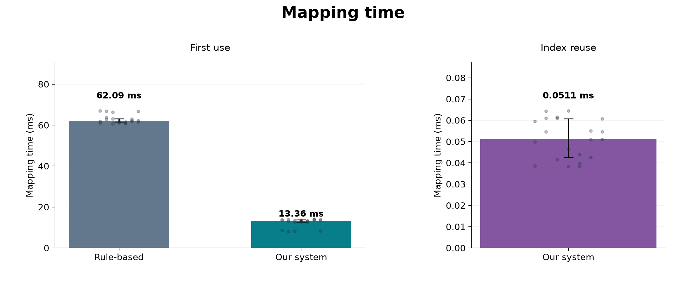
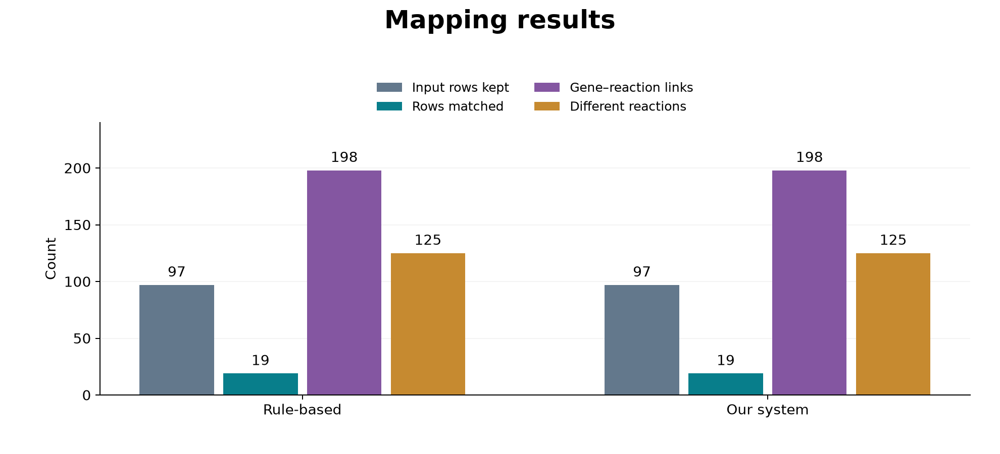

# ReconBridge

English | [한국어](README.ko.md)

**From genes to metabolic connections.**

An **Agent Skills package with Jev/Laya API integration** for mapping differential expression in two cell types to Recon3D reactions and auditing possible metabolite-mediated routes and their evidence limits.

## Features

- [Audit instructions](skills/recon3d-cross-cell-deg/SKILL.md) covering Recon3D routes, GPR rules, paired patient evidence, full-family statistical testing, and evidence grades
- Codex/ChatGPT and Claude plugin manifests, plus a Claude marketplace
- Installation tools for Codex, Claude Code, Cursor, and Gemini CLI, with framework-independent instruction export
- A **TypeSafe Jev System One API** client and connections to **Laya** servers using the same HTTP contract
- Optional review ordering that retains every candidate and records failures, model IDs, probabilities, and usage
- Synthetic HTTP contract tests and Linux/macOS/Windows CI

The executable code handles installation, packaging, instruction loading, API calls, and review ordering. Recon3D models, patient data, and the scientific pipeline for path enumeration, GPR calculation, and statistical analysis are not included. Supply the model and expression inputs and run analysis tools according to the skill instructions.

## Benchmark on the supplied test file

Using `DEG_hits_CD4_and_HF.csv` (97 rows, 66 genes) and Recon3D (10,600 reactions), **indexed DEG-to-reaction mapping took 13.36 ms versus 62.09 ms for a new repeated-scan reference: 4.65× faster, or 78.5% less time**, including index construction. Values are medians of 21 repetitions on Darwin arm64, Python 3.14.4; common file loading and validation are excluded.



Figure labels: **Rule-based** is the newly implemented repeated-scan reference; **Our system** is the indexed mapping implementation. The main panel includes index construction; the right panel shows reuse of an existing index. These labels describe the mapping implementations, not Laya/Jev inference.

All 97 rows were retained and the same **198 row–reaction associations / 125 unique reactions** were returned, with 100% exact identity agreement and an independent oracle check. This demonstrates preserved mechanical output, not improved biological accuracy.



**Scope:** mapping membership in GPR expressions only. This newly implemented reference is not the previous prototype. Full route-search time, biological accuracy and Laya/Jev gains have not been measured. See [protocol, source hashes, raw timings, reproduction commands and SVG exports](benchmarks/README.md). Raw test data are not published.

## Quick installation

Python 3.10+ is required. No additional Python packages are needed.

```sh
git clone https://github.com/hpend2373/reconbridge.git
cd reconbridge
python3 tools/manage.py validate
python3 tools/manage.py install --framework codex
```

Choose the framework you use:

| Option | Local user installation path | Integration |
|---|---|---|
| `codex` | `~/.agents/skills/` | Native Codex Agent Skills |
| `claude` | `~/.claude/skills/` | Native Claude Code skills |
| `cursor` | `~/.cursor/skills/` | Native Cursor Agent Skills |
| `gemini` | `~/.gemini/skills/` | Gemini CLI versions supporting Agent Skills |
| `agents` | `~/.agents/skills/` | Other hosts that discover skills at this shared path |

For example, run `python3 tools/manage.py install --framework claude`. Use `--project /path/to/project` for a project installation or `--destination /path/to/skills` for another skills directory. Different existing content is not overwritten automatically. With `--replace`, the existing directory is moved to `skill-backups/` before replacement.

Invoke `$recon3d-cross-cell-deg` in Codex or `/recon3d-cross-cell-deg` in Claude Code after a direct skill installation. Let the host rediscover its skills before using them. Copying a skill directory installs it locally on that device; account-wide cloud installation is a separate step.

### Install as a Claude Code plugin

```sh
claude plugin marketplace add hpend2373/reconbridge
claude plugin install recon3d-cross-cell-deg@recon3d-skills
```

The plugin invocation is `/recon3d-cross-cell-deg:recon3d-cross-cell-deg`. Choose either direct skill installation or plugin installation.

### Package a plugin for your ChatGPT account

```sh
python3 tools/manage.py pack --kind plugin --output dist/recon3d-plugin.zip
```

Upload the generated ZIP through the ChatGPT plugin upload interface and install it in your account. Publishing to GitHub does not update an existing account plugin automatically. This public repository provides a distribution source that can be shared and installed across devices.

To create a standalone skill ZIP, run `python3 tools/manage.py pack --kind skill --output dist/recon3d-skill.zip`.

## Use with other agent frameworks

If a framework does not offer native skill discovery, load the instructions and pass them to the agent's instruction or system input. This interface does not depend on a particular model SDK.

```sh
python3 skills/recon3d-cross-cell-deg/scripts/recon3d.py prompt --json
```

```python
import sys
from pathlib import Path

scripts = Path("skills/recon3d-cross-cell-deg/scripts").resolve()
sys.path.insert(0, str(scripts))
from recon3d_bridge import load_instructions, JevClient, prioritize

instructions = load_instructions()  # Pass to the framework's instruction/system input
client = JevClient()               # Reads TYPESAFE_API_KEY from the environment
```

You can load instructions this way and wrap the API client as a tool function. Automatic installation and execution are not guaranteed for every version of every framework. The host's context capacity, Python execution tools, model, and input data must be configured separately.

## Use the Jev API

The client supports `noul`, `choice`, and `score` according to the [official TypeSafe HTTP contract](https://docs.typesafe.ai/api). Set your API key in the `TYPESAFE_API_KEY` or `JEV_API_KEY` environment variable, then run:

```sh
python3 skills/recon3d-cross-cell-deg/scripts/recon3d.py models --provider jev
python3 skills/recon3d-cross-cell-deg/scripts/recon3d.py evaluate \
  --input examples/decision.json --output outputs/decision.json
python3 skills/recon3d-cross-cell-deg/scripts/recon3d.py prioritize \
  --input examples/candidates.json --output outputs/priorities.json
```

Add `--dry-run` to `evaluate` to validate a request without a key. Add `--no-model` to `prioritize` to retain the full candidate list without API calls. All examples use synthetic data.

### Connect to Laya

Start a Jev-compatible HTTP server first, then select a model it actually serves:

```sh
python3 skills/recon3d-cross-cell-deg/scripts/recon3d.py models --provider laya
python3 skills/recon3d-cross-cell-deg/scripts/recon3d.py prioritize \
  --provider laya --model laya --base-url http://127.0.0.1:8000/v1 \
  --input examples/candidates.json --output outputs/laya-priorities.json
```

Set `LAYA_API_KEY` if the Laya server requires authentication. See the [integration reference](skills/recon3d-cross-cell-deg/references/decision-api.md) for the full request contract, error handling, retries, and interpretation.

## Validation and compatibility scope

```sh
python3 tools/manage.py validate
python3 -m unittest discover -s tests -v
claude plugin validate .claude-plugin/plugin.json --strict
claude plugin validate .claude-plugin/marketplace.json --strict
```

Tests use a real loopback HTTP server, so local sockets must be allowed. No API key or model weights are required.

| Component | Validation scope |
|---|---|
| Skill/plugin | Names, versions, paths, original instruction integrity, and official Claude validators |
| Installation | Copies to each target path, execution of the installed CLI, preservation and backup of existing content |
| Jev/Laya API | Requests and responses against a synthetic server; all three primitives, authentication, error and probability validation, and retries |
| Candidate handling | Retention of successful and failed candidates; scientific review remains `pending` |
| CI | Contract and distribution tests on Python 3.10/3.13 across Linux, macOS, and Windows |
| Hosted Jev inference | Requires separate validation in an environment with an API key |
| Real Laya inference | Requires separate validation with a running server and model weights |

Compatibility references: [Agent Skills specification](https://agentskills.io/specification), [Codex skills](https://learn.chatgpt.com/docs/build-skills), [Claude Code skills](https://code.claude.com/docs/en/skills), [Claude plugins](https://code.claude.com/docs/en/plugins-reference), [Cursor skills](https://cursor.com/docs/skills), [Gemini CLI skills](https://geminicli.com/docs/cli/skills/), [Jev API](https://docs.typesafe.ai/api), and [Laya source](https://github.com/NandhaKishorM/laya).

## Inputs and evidence limits

The Recon3D model must include reaction IDs, full stoichiometry, bounds, GPR rules, compartments, and gene mappings. A DEG summary and model allow endpoint mapping and inspection of model-permitted routes. Evidence across an entire route requires patient-level pre/post expression, detected cell counts, normalization information, pairing, and full-family statistics.

RNA proxies and Jev/Laya scores do not establish enzyme activity, metabolite abundance, intercellular transfer, flux, or causality. API guidance proposes review order; it does not remove candidates or determine evidence grades. Do not mark scientific review complete before every candidate has been reviewed.

## Provenance

The first 17,107 bytes of the supplied original `SKILL.md` were preserved unchanged, with optional API integration guidance appended. Original SHA-256: `8c940dbced24938533ce69dc0260fa88159d6b49e4a33812bb871840ad76fdd8`. The original Rinvoq paths are optional reuse pointers for environments where that project is accessible.
