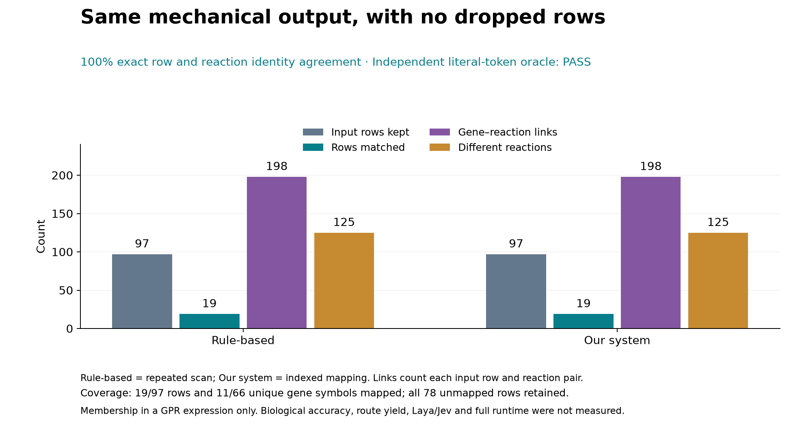

# Real-input mapping benchmark

[English README](../README.md) · [한국어 README](../README.ko.md)

Measured on **2026-09-30**, using the supplied `DEG_hits_CD4_and_HF.csv` and `Recon3D.json`. This benchmark covers **exact gene-symbol to reaction membership mapping**. It compares a newly implemented repeated-scan reference with an inverted index. The previous `recon3d-route-system` prototype and its original results were unavailable in this environment, so this is not a measured before/after comparison of that prototype or of Laya/Jev.

## Time and output

Both figures use the same simple method labels: **Rule-based** = the newly implemented repeated-scan reference; **Our system** = indexed mapping. These are mapping-stage implementations. They do not label a measured model-assisted or end-to-end system comparison.


| Method | Median time | IQR | Index construction |
|---|---:|---:|---|
| Rule-based | 62.091 ms | 61.581–63.055 ms | No index |
| Our system: first use | 13.359 ms | 12.719–13.721 ms | Included on every invocation |
| Our system: existing index | 0.0511 ms | 0.0426–0.0607 ms | Excluded; separate reuse measurement |

**With index construction included: 4.65× faster, or 78.5% less mapping time.** This is a ratio of medians, not the median of paired speedups. The reuse measurement requires an existing index for the same model and is not a first-use or full-pipeline speedup.



All three methods returned identical row identities and reaction memberships in every timed run: **97 rows retained, 19 mapped rows, 198 row–reaction associations, 125 unique reactions**. An independently implemented literal-token oracle agreed with the reference. Exactly 11 of 66 unique gene symbols mapped using model gene names; all 78 unmapped rows were retained. An association counts one reaction for one analysis/gene row, so it is not a unique reaction or a cross-cell route.

The effectiveness result is **preservation of mechanical mapping output**, with no measured biological accuracy or route-yield improvement. A gene appearing in a GPR does not establish activity of an AND/OR complex, reaction direction, RNA support, metabolite transfer, or flux. Laya inference, Jev inference, complete route-search time and biological accuracy remain unmeasured.

## Protocol and provenance

- Full input: 97 DEG rows, 66 unique gene symbols, six analysis groups; 10,600 model reactions and 2,248 model genes. No subset selection based on timing or model scores.
- 21 repetitions per method, rotating and reversing method order; `perf_counter_ns` timing. Points show individual observations; error bars show the interquartile range, not a confidence interval.
- File reading, model parsing and common input validation were excluded from the three method times. That common stage was separately recorded as 44.105 ms in this run. Imports, correctness checks and the independent oracle were also outside the timed intervals. The benchmark does not measure process startup or end-to-end analysis.
- Exact gene-name matching, no alias inference. All model gene IDs sharing a name are included. Reaction IDs are deduplicated within each row. Zero-hit rows stay in the output.
- Environment: Darwin arm64, Python 3.14.4. These small absolute times are hardware and implementation dependent; they do not predict cloud inference latency.
- Input hashes bind the report to the byte snapshots parsed. Raw DEG rows, patient expression values and the model are not distributed in this repository. Output identity is recorded as a digest; aggregate statistics and all 63 timing observations are public.

| Source | SHA-256 |
|---|---|
| `DEG_hits_CD4_and_HF.csv` | `ec2363f12984ea9e921bac81de79229d0aa63b2c257761b877f572e2600d5288` |
| `Recon3D.json` | `aba925f17547a42f9fdb4c1f685d89364cbf4979bbe7862e9f793af7169b26d5` |
| Canonical mapped output | `b05d272e01d4e656e2f48c31257d0ae55e6c4179c83d0fa35ac6e9c03a3a2c4b` |

Machine-readable evidence: [summary and measured source hashes](results/2026-09-30-mapping/summary.json), [raw timings](results/2026-09-30-mapping/timings.csv). Export figures: [runtime SVG](results/2026-09-30-mapping/mapping-runtime.svg), [output SVG](results/2026-09-30-mapping/mapping-output.svg).

## Reproduce

The mapping benchmark and checks use only the Python standard library. Supply your own copies of the files; choose a new output directory to preserve prior measurements.

```sh
python3 benchmarks/check_mapping.py
python3 benchmarks/check_report.py
python3 benchmarks/benchmark_mapping.py \
  --deg /path/to/DEG_hits_CD4_and_HF.csv \
  --model /path/to/Recon3D.json \
  --output /path/to/new-benchmark-run --repeats 21
```

`check_mapping.py` covers exact gene IDs, shared symbols, nested GPR membership, unmatched-row retention, row removal, equal-count membership substitution and invalid inputs. `check_report.py` independently recomputes recorded statistics, checks frozen source hashes and confirms that disabling the equality guard in an isolated scratch copy makes verification fail. Both checks run in CI. The independent oracle runs on actual input during each new benchmark.

Rendering figures requires the optional Matplotlib dependency; this is separate from skill/API installation:

```sh
python3 -m venv /tmp/recon3d-plots
/tmp/recon3d-plots/bin/python -m pip install -r benchmarks/requirements-plot.txt
/tmp/recon3d-plots/bin/python benchmarks/plot_results.py
```

For another run, pass `--report /path/to/new-benchmark-run` to the plot script. It verifies the recorded timing data and source identity before plotting. Repeated hardware measurements may produce different timing results with the same mechanical output.
